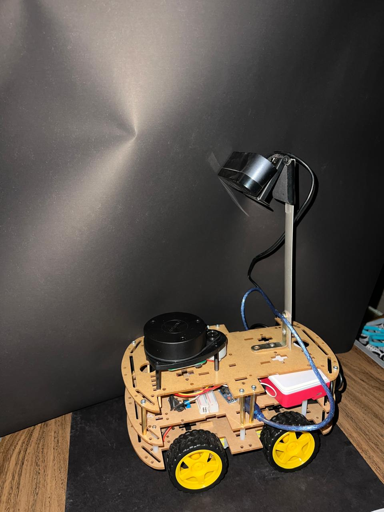
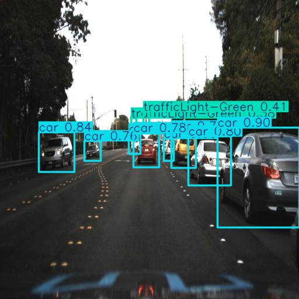
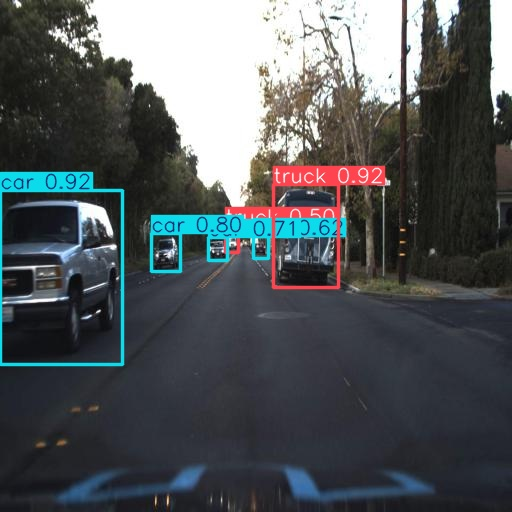
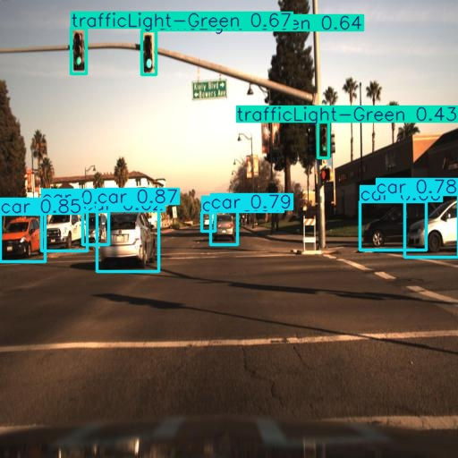

#  AI Self-Driving Car

An autonomous self-driving car prototype developed as our Computer Engineering graduation project.

##  Project Overview

The objective of this project is to build a prototype autonomous vehicle capable of understanding its environment, planning a path, and making safe driving decisions with minimal human intervention.

---

##  System Architecture

The project consists of four main layers:

1. Perception Layer
2. Global Planning Layer
3. Local Planning Layer
4. Control Layer

---

##  My Role

As the **Team Leader**, I was responsible for the **Perception Layer**, including:

- Training YOLOv8n
- Dataset preparation
- Data augmentation
- Model evaluation
- Performance optimization for Raspberry Pi

---

##  Technologies

- Python
- YOLOv8
- Ubuntu
- Raspberry Pi
- Computer Vision
- Artificial Intelligence

---

##  Model Performance

| Metric | Score |
|---------|--------|
| Precision | 87% |
| Recall | 79% |
| mAP@50 | 89% |
| F1 Score | 82% |

---

##  Project Images

### Vehicle

---

### Detection Result 1

---

### Detection Result 2

---

### Detection Result 3

---

## 📌 Future Improvements

- Improve small object detection.
- Deploy optimized ONNX model.
- Support additional driving scenarios.
